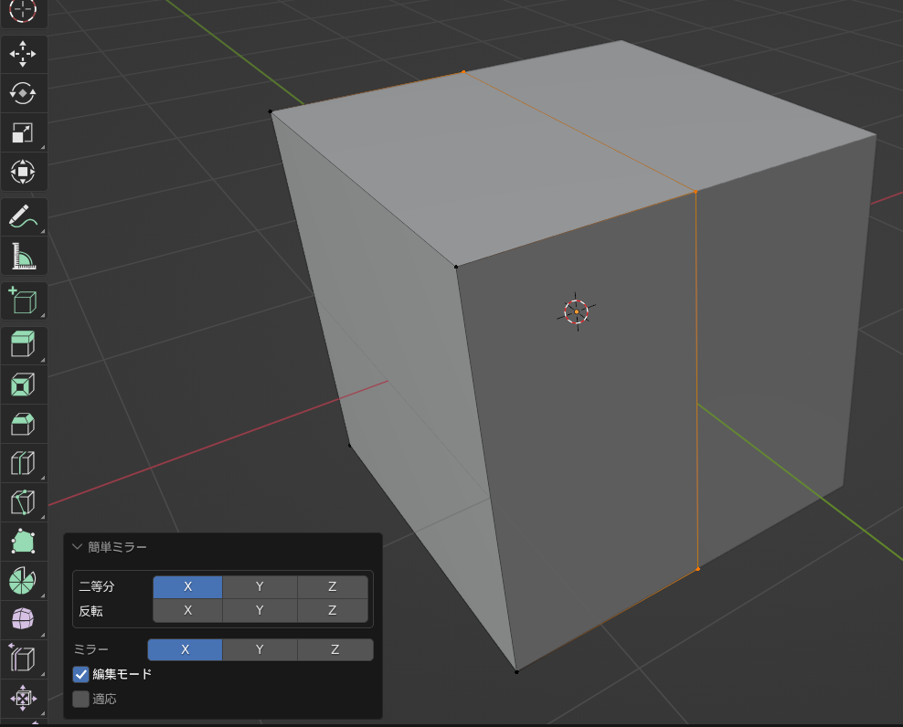
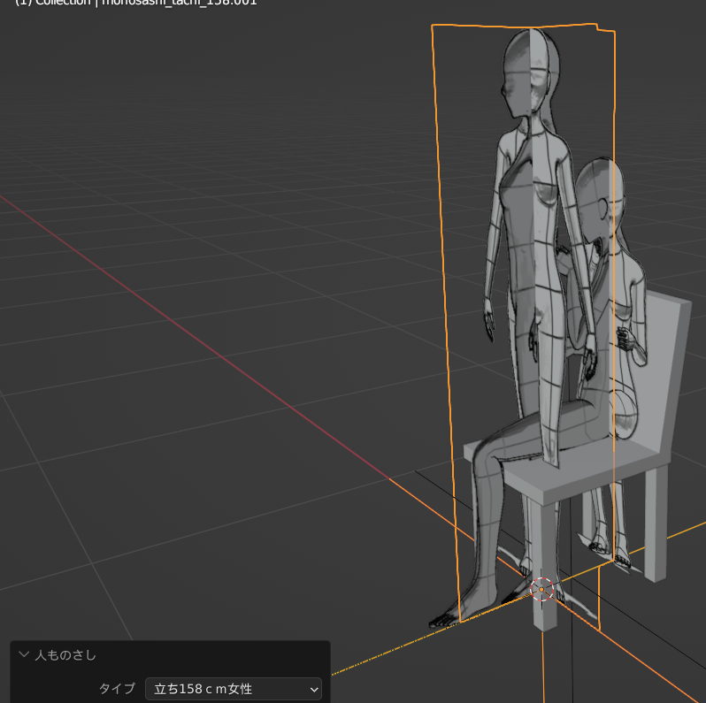
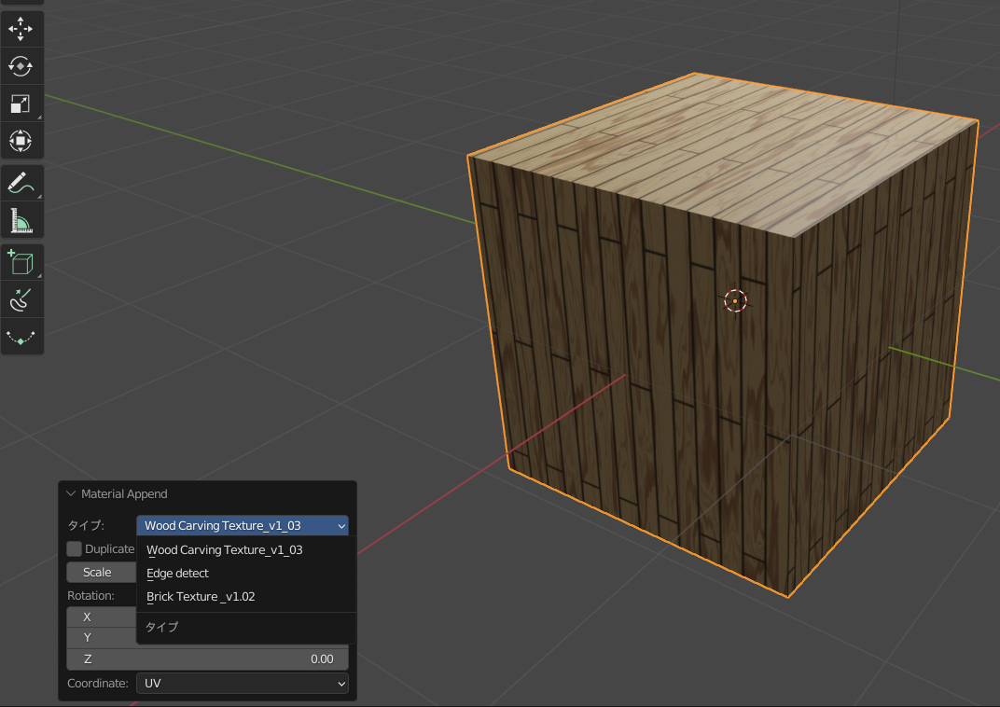

.. _ksyn_ops2:

############################
KSYN OPSその他の機能
############################

.. _bebel:

==========
Bevel機能
==========

.. image:: bevel.mp4

選択したオブジェクトにBEVELを割り当てるオペレーターパネルです。
アクティブなオブジェクトで、”Ksyn_Bebel”という名前がついているBEVELのみだけ
パネルから直接値を変化出来ます。

.. _mirror:

==========
ミラー機能
==========

普通のミラー機能ですが、
自動で二等分していますので、メッシュの自動整形にとても便利です。
反転ボタンを押すと指定の軸に沿って反転します。

.. _人ものさし:

==========
人ものさし
==========

クリップスタジオの人形に合わせた、オブジェクトを作成できます。
クリップスタジオのモデルとほぼ同じ寸法ですので、クリスタのエクスポートの際にとても便利なアセット機能です。

.. _エンプティの挿入:

================
エンプティの挿入
================
.. figure:: empty_demo.mp4
    :width: 500
    :height: 300
    :class: controls
.. image:: emptyadd.png

選択されたオブジェクトの親にエンプティを挿入できます。
つかみやすいに用にデフォルトで矢印を採用してあります。

.. _マテリアルの適応:

================
マテリアルの適応
================

選択されたオブジェクトに三種類のマテリアルを適応できます。
詳細はマテリアルの設定でお願いします。

