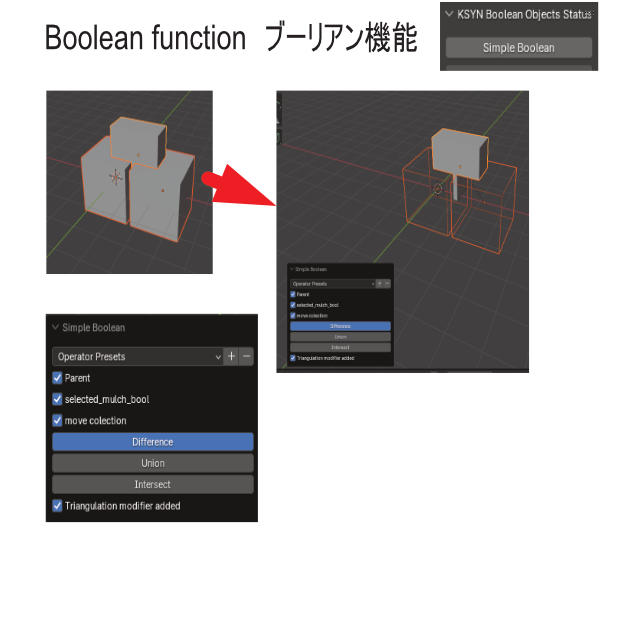
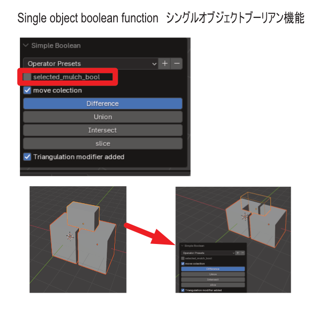
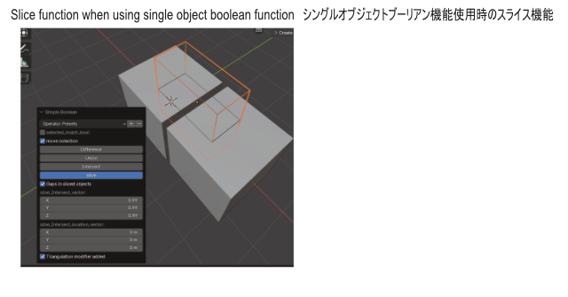
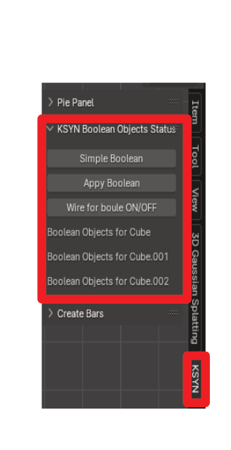

.. _miniconda:

##########################
KSYN OPSブーリアン
##########################

.. image:: job_3d_cad_designer.png

.. _miniconda-install:

********************
ブーリアン機能の概要
********************
.. figure:: boolean_demo.mp4
    :width: 500
    :height: 300
    :class: controls

デフォルの設定では最後に選択されたオブジェクトにブーリアンが適応されます。
自動で親子化機能も搭載されていますので、ブーリアンされたオブジェクトを移動しても形が崩れる事はありません。
「複数でブール」を押すと最後に選択されたオブジェクトが複数のオブジェクトに適応されます。

==================================
ブーリアン(マルチオブジェクト)
==================================
.. figure:: boolean_demo_マルチブーリアン.mp4
    :width: 500
    :height: 300
    :class: controls

選択したオブジェクトの最後のオブジェクトに複数のオブジェクトが適応されます。
交差を選択した場合、複数のオブジェクトが全部重なってないと何も表示されないので、
ご注意下さい。

=======================
シングルブーリアン
=======================
.. figure:: boolean_demo_singleboolean.mp4
    :width: 500
    :height: 300
    :class: controls

シングルブーリアンは一つのオブジェクトが複数のオブジェクトに適応されます。

.. figure:: boolean_demo_singleboolean(join).mp4
    :width: 500
    :height: 300
    :class: controls
    
もし、統合を使用した場合、複数に一つのオブジェクトが統合されるので、当然重なります。
一度アプライして統合されるかどうか確認してみる必要があるかもしれません。

============
スライス機能
============
.. figure:: boolean_demo_slice.mp4
    :width: 500
    :height: 300
    :class: controls

最後に選択したオブジェクトを基準にしてオブジェクトをスライス（つまり、オブジェクトが分離します。）
します。
シングルオブジェクトブーリアン機能の画面にしかスライス使えないのでご注意下さい。

.. _miniconda-setting:

================
ブーリアンパネル
================
.. figure:: boolean_demo_panel.mp4
    :width: 500
    :height: 300
    :class: controls

パネル画面でブーリアンのON　OFFまた、
オブジェクトの表示の確認・非表示が可能になっております。
アプライも可能です。

.. _boolean-apply:

==================
ブーリアンアプライ
==================

.. figure:: boolean_demo_singleboolean_slice.mp4
    :width: 500
    :height: 300
    :class: controls

パネルにある選択したオブジェクトの全てのブーリアンを適応するスクリプトです。
ブーリアンの順番によっては上手くアプライ出来ないかもしれません。

スライス機能などの複雑なブーリアンを使用している場合においては、
一度複数のオブジェクトをアプライして本当に意図した分離や交差などになっているか確認するのに
便利な機能です。

.. _boolean_demo_gousei:

========================
ブーリアンの便利な使い方
========================

.. figure:: boolean_demo_gousei.mp4
    :width: 500
    :height: 300
    :class: controls

ブーリアン適応において、順番を間違えると正常にブーリアンが適応されない場合があります。

例えば、動画の例ですが、このアドオンが用意したブーリアン適応を普通に押しても、
合成が適応されません。適応の順番を変えても同様です。

この場合、一度オブジェクトで適応されたくない以外のモディファイアをオフにして、

オブジェクト＞適応＞表示の形状をメッシュ化

をして見てください。
